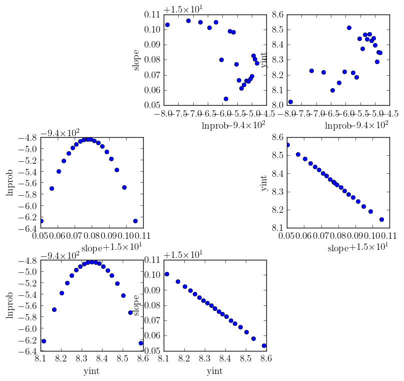

# Summary

*phymcmc* is primarily a wrapper for emcee [@emcee], but can also perform or facilitate a number of other data analysis and visualisation tasks. emcee [@emcee] is a Python ensemble sampling toolkit for affine-invariant Markov chain Monte Carlo (MCMC). *phymcmc* provides a model class and a parameter class to describe one's computational (e.g., agent-based or individual-based model) or mathematical (e.g., ordinary or partial differential equations) model and associated parameters. The parameter class can be used to set constraints (e.g., ranges) on parameters to be estimated, and to separate which parameters are to be fixed and which are to be estimated.

Having defined a model and a parameter instance, phymcmc scripts and modules can be used to fit the model to data to obtain so-called best-fit parameters; or to obtain posterior parameter likelihood distributions (PostPLDs) based on the MCMC process implemented in emcee [@emcee]. 

*phymcmc* stores the results of the MCMC sampling process in a *phymcmc*-defined hdf5 file format via h5py [@h5py]. The *phymcmc* hdf5 files can be parsed/analysed by *phymcmc*-provided scripts to:

* obtain p-values when comparing parameter PostPLDs for 2 different MCMC analyses, e.g.\ comparing 2 hdf5 files for the same data but different models (see `bin/phymcmc_parstats`);
* add derived parameters computed by rescaling or combining estimated parameters (see `examples/linear/add_biopars`);
* get dumps of a specific parameter or the parameter set with the highest likelihood (see `bin/phymcmc_peakachain`); or
* create with matplotlib [@matplotlib] a number of useful plots (see `bin/phymcmc_plotter`):
  * diagnostic plot to evaluate whether the chain has converged (see Figure 1);
  * histograms of individual parameter's PostPLDs (see Figure 2);
  * pair-wise PostPLDs using corner.py [@corner] to identify parameter correlations (see Figure 3); or
  * square plot, another way to look at pairwise parameter correlations (see Figure 4); or

*phymcmc* has been used in a number of publications in [virophysics](https://en.wikipedia.org/wiki/Virophysics) [@simon16; @beauchemin17; @beauchemin19]. Example models and parameters are provided in *phymcmc*'s GitHub repository where development takes place.

![Triangle (or corner) plot produced with corner.py [@corner] showing pairwise parameter correlations for the linear example.](chain_lin_triangle.png)

# Acknowledgements

Development was supported in part by Discovery Grant 355837-2013 from the [Natural Sciences and Engineering Research Council of Canada](http://www.nserc-crsng.gc.ca) and by [Interdisciplinary Theoretical and Mathematical Sciences (iTHEMS)](https://ithems.riken.jp) at [RIKEN](http://www.riken.jp).

# References
